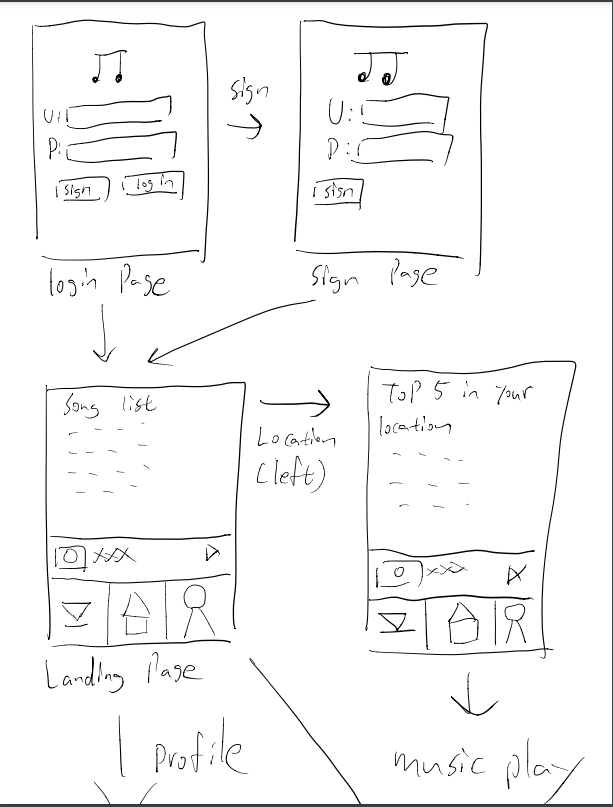
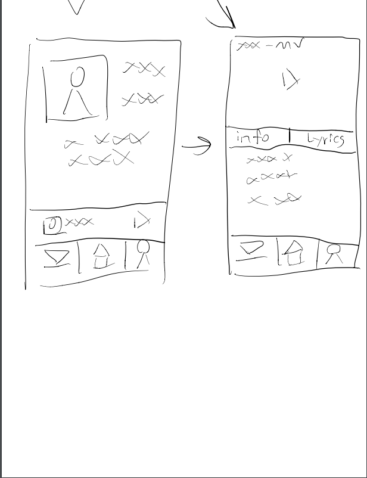

# iCharts

## Table of Contents
1. [Overview](#Overview)
1. [Product Spec](#Product-Spec)
1. [Wireframes](#Wireframes)
2. [Schema](#Schema)

## Overview
### Description
Discover new songs through a discover page, by clicking a song it will take you to a new page with the song's music video at the top and lyrics underneath. Users can save their favorite songs and revisit them later through their profile page. Also, users can discover popular music based off their location!

### App Evaluation
- **Category:** Music / Discovery
- **Mobile:** Mobile uses audio hardware to playback user's playlists and songs 
- **Story:** Allows users to browse and listen to new music on the go with a set of lyrics
- **Market:** Anyone that likes to listen music, users are able to find their specific interests by browsing through their preferred genre tab
- **Habit:** Users can listen nonstop if they choose, features like repeat and shuffle enable the user to spice up their listening 
- **Scope:** Main goal is to achieve a pleasant listening experience and navigation for discovering new music, can expand into chatting service between fans of similar artists 

## Product Spec

### 1. User Stories (Required and Optional)

**Required Must-have Stories**

* - [X] Login / register page
* - [X] Recycler view list of songs
* - [x] Show the MV(New activity screen with music video at the top and lyrics underneath)
* - [X] Uses parse as a backend 
* - [ ] Ability to playback songs for the user
* - [ ] Ability to change user profile by camera
* - [ ] Shazam-like audio listener

**Optional Nice-to-have Stories**

* - [ ] Different screens for the charts/genres
* - [ ] Implementing a shuffle and repeat features for song
* - [ ] Add a credits tab along with the music video and lyrics
* - [ ] Discover page can be sorted by genre


### 2. Screen Archetypes

* Login
* Register
   * Upon redownloading or open, user is prompted to login or create a new account.
* Discover page
   * The main screen where the user will spend most of their time with a list view of songs that a user can click on to lead them to a video and lyrics.
* Media player
   * When a user clicks on a song, this is the page where the song's music video plays with lyrics underneath
* Location based recommonded song page
    * Recycler view of top 5 songs that is chosen based off GPS location
* Profile
    * New activity screen where a user's profile image, age, favorite artist, and a list of favorite songs are shown

### 3. Navigation

**Tab Navigation** (Tab to Screen)

* Discover page
* Media player
* Location based recommonded song page
* Profile

**Flow Navigation** (Screen to Screen)

* Login/register
   * Account creation if no account is available
* Discover page with the list view of songs
   * When a song is selected, it'll take the user to the song's music video and lyric page
* Location based song page
    * Accessible through the navigation bar by selecting the map icon. 
* Media player
   * Prompted by the user selecting a song from the landing page
* Profile
    * Accessible through the navigation bar by selecting the profile icon

## Wireframes



## Schema 
### Models
#### Post

   | Property      | Type     | Description |
   | ------------- | -------- | ------------|
   | songID      | String   | unique id for each song (default field) |
   | userID        | String | Id of user|
   | passwordID         | String     | Password of user used to login |
   | playback       | Parse   | Backend for songs |
   | ArtistName | String   | Name of artists |
   | imageMV    | File   | image thumbnail of mv|
   | MusicVideo     | URL | Video of song |
   | songList     | String | List of songs |
   | lyrics       | String | Lyrics of song |
   | likesSong    | Number | number of likes for songs |
   | currentLocation | Location | Location give access to by the user and used to give back songs |
### Networking
#### List of network requests by screen
   - Home Feed Screen
      - (Read/GET) Query all songs where user is artist
         ```swift
        ParseQuery<Song> query = ParseQuery.getQuery(Song.class);
        query.include(Song.KEY_USER);
        query.setLimit(20);
        query.addDescendingOrder(Post.KEY_CREATED_KEY);
        query.findInBackground(new FindCallback<Song>() {
            @Override
            public void done(List<Song> songs, ParseException e) {
                if (e != null){
                    Log.e(TAG, "Issues with getting songs", e);
                    return;
                }
                for (Song song : songs){
                    Log.i(TAG, "Song:" + song.getLyrics() + ", username" + song.getUser().getUsername());
                }
                adapter.clear();
                allSongs.addAll(songs);
                swipeLayout.setRefreshing(false);
                adapter.notifyDataSetChanged();
         ```
      - (Create/POST) Create a new like on a song, song will be added to current user's profile page under favorite songs
      - (Delete) Delete existing like
   - Create Post Screen
      - (Create/POST) Create a new song object, based off of current signed in user's location (generate list of popular songs in their area)
   - Profile Screen
      - (Read/GET) Query logged in user object
      - (Update/PUT) Update user profile image, favorite songs, location


## Current Build Progress Walkthrough

Here's a walkthrough of build progess so far! (Up to date as of 3/30/2021):


GIF created with [LiceCap](http://www.cockos.com/licecap/).

## Current Build Progress Walkthrough sprint2
Milestone

Here's a walkthrough of build progess so far! (Up to date as of 04/06/2021):


For the media player page, because it depends on the the main page, so I only show my code and layout. In addition, we increase the style of the login page. 


## Current Build Progress Walkthrough sprint2 yc
Milestone

Here's a walkthrough of build progess so far! (Up to date as of 04/06/2021):


The implementation on mainpage(bottom menu), song list page, and SongsAdapter are finished. However, since the api we used need an api secret key and we cannot get response without the key, the song list is not showing. We have asked for the key and should get response soon. 

## Current Build Progress Walkthrough

Here's a walkthrough of build progess so far! (Up to date as of 4/13/2021):


Song list API is now working, added a profile page which allows users to change their profile picture with their phone camera with a compose fragment
